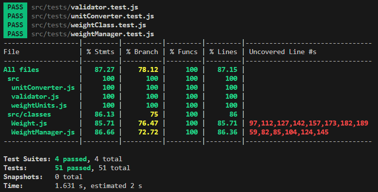

## Testrapport

## Introduktion

Jag skriver min testrapport på svenska då jag har med denna mapp i min npmignore och denna testrapport är för uppgiftens skull. Jag har skrivit testerna i Jest och min personliga tolkning är att jag endast behöver bifoga en bild över min coverage. Den publiceras här nedan.

## Tanken med testerna

Jag har försökt täcka det mesta jag kunde tänka mig i testerna, men samtidigt inte skapa alldeles för många. Jag vet med säkerhet att jag inte testar allt i och med coveragerapporten från Jest men jag är ändå mycket nöjd med min insats här då jag täckt det jag tycker är viktigast inom tidsramen.

## Automatiska tester och Test-App

Primärt körs automatiska tester, men jag ville även säkerställa att det fungerade när min modul var publicerad på npm. Jag startade därför en test-app och laddade ner mitt paket som om jag var en helt annan utvecklare och kunde arbeta med den utan problem. Därför bedömer jag att baserat på tidsramen, att jag ändå har testat modulen väl.

## Bild över coverage

